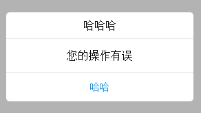
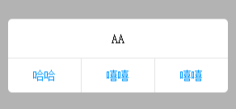
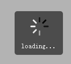
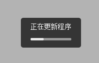

### 说明

根据个人需求，闲时动手写写案例。

这个demo中，主要写了移动端的几种弹窗类型，包括box(alert/confirm)、toast、loading等

### 使用

* 全局引用`popup.css`与`popup.js`
* 使用方式：
```javascript
// 1.alert/confirm
// 标题可选
Popup.alert([title], content, callback);

// 例如
Popup.alert("哈哈哈", "您的操作有误", [
	{name : "哈哈", ac : function() {alert("OK");}}
]);

Popup.confirm("哈哈哈", "AA", [
	{name : "哈哈", ac : function() {alert("haha");}},
	{name : "嘻嘻", ac : function() {alert("xixi");}},
	{name : "呵呵", ac : function() {alert("hehe");}}
]);

// 2.toast
// 内容、超时可选
Popup.toast([content], [timeout]);

// 例如
Popup.toast("去吧，皮卡丘！", 1000);

// 3.loading
// 文字可选，没填文字，默认转菊花
// <todo> 菊花瓣数、大小、颜色可配置
// Popup.showLoading([content]);

// 例如
Popup.showLoading("loading...");

// 4.close
// 关闭弹窗
Popup.close();

// 5.progress
// 文字可选，没填文字，默认"正在更新程序"
// Popup.progress([content]);

// 例如
var ProgressBar = Popup.progress();
var percent = 0;

var inter = setInterval(function() {
	if (percent > 100) {
		clearInterval(inter);
	}
	ProgressBar.update(percent);
	percent++;
}, 50);
```

### 展示

#### alert



#### confirm



#### loading 



#### toast


#### progress


